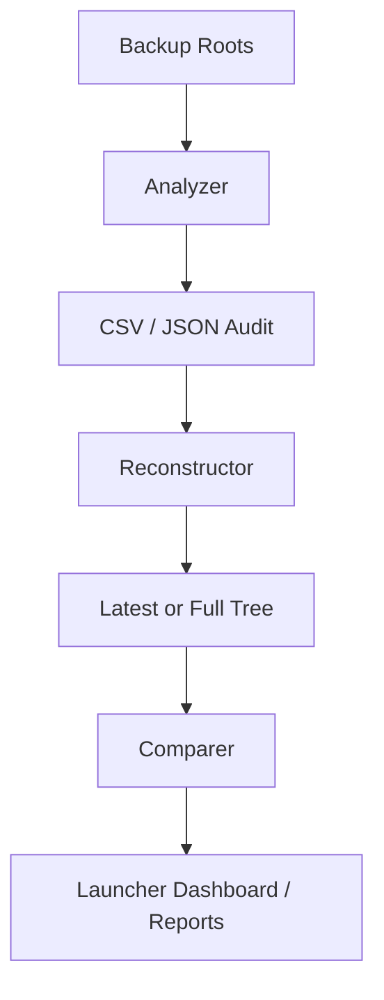

# 📘 Dart Backup Reconciliation Toolkit  
### Unified Documentation (2025 Edition) – v1.5

> Deterministic, auditable reconciliation of Dart/Flutter sources across multiple backup trees.

---

## 1. Overview

This toolkit solves:

> “I have many backup copies of the same Flutter/Dart project. Each tree contains some files that are newer, some older, some missing. I need a deterministic, auditable way to find the newest version of each Dart file, reconstruct a unified ‘latest tree’, and compare trees.”

Components:

- **Analyzer** – `find_latest_flutter_source_vX.sh`
- **Reconstructor** – `reconstruct_latest_tree_vX.sh`
- **Comparer** – `compare_reconstructed_trees.sh`
- **Launcher** – `dart_backup_launcher_v1.5.sh`
- **Presets System** – `presets.d/*.conf`
- **Docs & Diagrams** – Markdown, HTML, Mermaid, ASCII

---

## 2. Installation

```bash
unzip dart_backup_master_distribution_v1.x.zip
chmod +x dart_backup_launcher.sh
```

Optional (for best UX):

```bash
sudo dnf install fzf     # or apt install fzf
sudo dnf install newt    # provides whiptail
```

Your directory should include:

```text
dart_backup_launcher.sh
find_latest_flutter_source_vX.sh
reconstruct_latest_tree_vX.sh
compare_reconstructed_trees.sh
presets.d/
docs/
site/
```

---

## 3. Analyzer – `find_latest_flutter_source_vX.sh`

### Purpose

Scan one or more backup roots, discover Dart files, group them, and determine the newest instance per group.

### Key Features

- Multiple roots: `--paths DIR1 --paths DIR2 ...`
- Directory pattern filter: `--pattern "*ir_imagery_tools*"`
- Grouping modes:
  - `basename` – group by filename only
  - `relpath` – group by path under `lib/` (recommended)
  - `fullpath` – no grouping (debug)
- Latest-per-file analysis (always on)
- SHA256 + size tracking
- Optional instance listing:
  - modification time
  - SHA256
  - size
  - full path
- Exports:
  - `--csv audit.csv`
  - `--json audit.json`
- Quality-of-life:
  - `--diff-vs-latest`
  - `--color-newest`
  - `--log-file` (or launcher auto logs)
  - HTML report auto-open via launcher

### Typical command

```bash
./find_latest_flutter_source_v1.9.2.sh \
  --paths "/backup/rootA" \
  --paths "/backup/rootB" \
  --pattern "*ir_imagery_tools*" \
  --group-by relpath \
  --include-instances \
  --csv dart_audit.csv \
  --json dart_audit.json \
  --log-file analyzer_run.log
```

---

## 4. Reconstructor – `reconstruct_latest_tree_vX.sh`

### Purpose

Consume analyzer CSV/JSON and reconstruct a synthetic Dart tree representing:

- Only newest instances (`--latest-only`), or
- Full history (`.LATEST` + `.OLD_n` variants)

### Features

- Input:
  - `--json audit.json` **or**
  - `--csv audit.csv`
- Modes:
  - `--latest-only` – newest per group only
  - default – full history tree
- Integrity:
  - `--verify-checksums` – SHA256 validation
- Safety:
  - `--dry-run` – plan only, no copying
  - Safety lock in launcher for non-empty `--out` dirs
- Reporting:
  - `--html-report file.html`
- Performance:
  - Parallel copy via `xargs -P`

### Latest-only example

```bash
./reconstruct_latest_tree_v1.1.1.sh \
  --json dart_audit.json \
  --out latest_tree/ \
  --latest-only \
  --verify-checksums \
  --html-report latest_tree.html
```

### Full-history example

```bash
./reconstruct_latest_tree_v1.1.1.sh \
  --csv dart_audit.csv \
  --out full_history_tree/ \
  --verify-checksums \
  --html-report full_history.html
```

---

## 5. Comparer – `compare_reconstructed_trees.sh`

### Purpose

Compare two reconstructed trees to identify:

- Files only in A
- Files only in B
- Files present in both but different

### Usage

```bash
compare_reconstructed_trees.sh treeA/ treeB/ --tool meld
```

Supported tools:

- `meld`
- `code` (VS Code `code --diff`)
- `vimdiff`
- `diff` (fallback)

---

## 6. Presets System – `presets.d/*.conf`

Each preset is a `.conf` file, for example:

```bash
# presets.d/ir_imagery_tools.conf
PRESET_NAME="IR Imagery Tools WIP"
PRESET_DESC="Main IR Imagery multi-backup reconciliation preset."

ANALYZER_CMD='find_latest_flutter_source_v1.9.2.sh \
  --paths "/run/media/.../ProjectWorkingCopyBackups" \
  --pattern "*ir_imagery_tools*" \
  --group-by relpath \
  --include-instances \
  --csv "dart_audit_ir_${TODAY}.csv" \
  --json "dart_audit_ir_${TODAY}.json" \
  --log-file "find_latest_flutter_source_ir_${TODAY}.log"'

RECON_LATEST_CMD='reconstruct_latest_tree_v1.1.1.sh \
  --json "${LATEST_JSON:-dart_audit_ir_${TODAY}.json}" \
  --out "latest_tree_ir_${TODAY}/" \
  --latest-only \
  --verify-checksums \
  --html-report "latest_tree_ir_${TODAY}.html"'

RECON_FULL_CMD='reconstruct_latest_tree_v1.1.1.sh \
  --csv "${LATEST_CSV:-dart_audit_ir_${TODAY}.csv}" \
  --out "full_history_tree_ir_${TODAY}/" \
  --verify-checksums \
  --html-report "full_history_tree_ir_${TODAY}.html"'
```

### Dynamic variables

The launcher sets and exports:

- `${TODAY}` – `YYYYMMDD`
- `${NOW}` – `YYYYMMDD_HHMMSS`
- `${LATEST_JSON}` – most recent `*.json` in current tree
- `${LATEST_CSV}` – most recent `*.csv` in current tree

Available inside preset commands.

---

## 7. Launcher – `dart_backup_launcher_v1.5.sh`

The launcher is your command center.

### Main Menu (conceptual)

```text
1) Analyzer (with presets)
2) Reconstructor (with presets + safety lock)
3) Tree Diff Viewer (Comparer)
4) Prep / Env Check
5) Logs & Dashboard
6) Recent Artifacts Browser (JSON/CSV/HTML)
7) Preset Browser (description + last-run)
q) Quit
```

### Key capabilities

- Preset selection (from `presets.d/*.conf` or `presets.conf`)
- fzf / whiptail full-screen menus (if installed)
- Automatic log naming:
  - `logs/<PresetName>_<Mode>_<YYYYMMDD_HHMMSS>.log`
- Recent-artifacts browser:
  - browse latest `.json`, `.csv`, `.html`
  - open HTML in browser via `xdg-open`
- Logs & Dashboard:
  - history tail (`.dart_backup_history`)
  - basic dashboard of recent runs
  - analyzer stats from logs (groups, instances, export files)
  - export dashboard to Markdown (Obsidian-ready)
- Safety lock for reconstructor:
  - detects non-empty `--out` directories
  - requires typing `YES` to proceed

---

## 8. Safety Lock Details

Before running a reconstruction command, the launcher:

1. Parses `--out <DIR>` from the command.
2. If `<DIR>` exists and is not empty:
   - prints a warning
   - requires explicit confirmation:
     - `Type EXACTLY 'YES' to proceed:`
3. Any other input cancels the run.

This protects against accidental overwrites of hand-curated trees.

---

## 9. Logs, History & Dashboard

### History file

All runs are logged to:

```text
.dart_backup_history
```

Example line:

```text
2025-12-06 18:44:01 | DUR=25s | PRESET=IR Imagery Tools WIP:ANALYZER | find_latest_flutter_source_v1.9.2.sh ...
```

### Log files

Per-run logs are stored under:

```text
logs/
  IR_Imagery_Tools_WIP_ANALYZER_20251206_184401.log
  IR_Imagery_Tools_WIP_RECON_FULL_20251206_185012.log
```

(Names generated from `PRESET_NAME`, mode, and timestamp.)

### Analyzer stats from logs

From the launcher, you can select a log and extract:

- Groups processed (`Processing group key:` lines)
- Instance blocks (`Instances of group` lines)
- Detected CSV/JSON exports
- Last 10 lines of the log

---

## 10. Recent Artifacts Browser

The launcher scans for:

- `*.json`
- `*.csv`
- `*.html`

Sorted by modification time (newest first).  

You can select an artifact:

- If HTML – it opens in your browser.
- If JSON/CSV – it shows the first 40 lines.

---

## 11. Dashboard Markdown Export (Obsidian-ready)

One launcher option writes a summary like:

```markdown
# Dart Backup Toolkit – Dashboard Summary (2025-12-06)

## Recent Runs
- 2025-12-06 18:44 | DUR=25s | PRESET=IR Imagery Tools WIP:ANALYZER
- 2025-12-06 18:47 | DUR=40s | PRESET=IR Imagery Tools WIP:RECON_LATEST

## Analyzer Summary
- Groups processed: 122
- Instances listed: 366
- CSV: dart_audit_ir_20251206.csv
- JSON: dart_audit_ir_20251206.json

## Files
- Latest JSON: dart_audit_ir_20251206.json
- Latest HTML: latest_tree_ir_20251206.html
```

You can drop this directly into your Obsidian vault.

---

## 12. Diagrams

### Mermaid



### ASCII

```text
Backup Roots
     │
     ▼
Analyzer ───► Audit Files (CSV/JSON)
     │                │
     │                ▼
     │        Reconstructor
     │         (latest / full)
     │                │
     ▼                ▼
Dashboard ◄────── Synthesized Tree
     │
     ▼
Comparer (meld/code/vimdiff)
```

---

## 13. Recommended Workflow

1. Run analyzer via launcher preset.
2. Inspect audit CSV/JSON + any HTML reports.
3. Dry-run reconstruction (`--dry-run`) to validate output plan.
4. Run full reconstruction with safety lock confirmation.
5. Compare reconstructed tree vs existing tree using comparer.
6. Export dashboard Markdown into Obsidian.
7. Commit reconstructed tree into version control.

---

## 14. FAQ

**Q: Can the analyzer scan multiple roots?**  
Yes, repeat `--paths` or use multiple args to `--paths`.

**Q: Which group-by mode should I use?**  
Use `relpath` unless your layout is extremely irregular.

**Q: Does the reconstructor maintain directory layout?**  
Yes, it reconstructs using the group key, which is typically a relative path under `lib/`.

**Q: Do I have to use the launcher?**  
No. All scripts can be run directly. The launcher just saves time and reduces mistakes.

---
